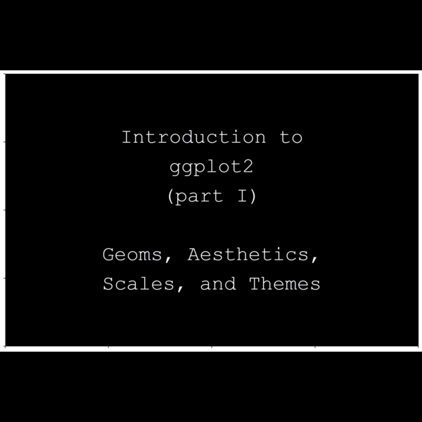

{width=75% height=75%} 

# Preamble 

This is a beginner's guide to `ggplot2`. I created this guide because I have been asked often enough to help with plotting that I figured I should start my own guide. It is nice to have an instructional tool that is written in your own voice.

With that said, there are many fantastic `ggplot2` guides that already exist.

- This [extensive tutorial](https://www.cedricscherer.com/2019/08/05/a-ggplot2-tutorial-for-beautiful-plotting-in-r/) by Cedric Scherer is fantastic.

- The [Anthro-Data-Science](https://anthro-data-science.github.io/) group that I work in has [introductory](https://github.com/anthro-data-science/intro-data-viz-ggplot) and [advanced](https://github.com/anthro-data-science/data-viz-pt2) tutorials on `ggplot2.` 

- Then there is Hadley Wickhams official [book](https://ggplot2-book.org/) on the package.

And of course many more... 

# Getting started 

The first thing we will do is create a toy dataset to visualize.

```{r}
set.seed(27)
N <- 1e4                        # number of rows
X <- rnorm(N)                   
Y <- rnorm(N, 0-X^2)
Z <- rnorm(N, 0+X+Y)
d <- data.frame(X,Y,Z)          # store in a data.frame
head(d)
```

We also need the `tidyverse` suite that contains `ggplot2` and many other useful packages. 

```{r}
#install.packages(tidyverse)
library(tidyverse)
```

The `ggplot2()` function is where we specify our variables. There are two  
ways to do this. 1) You can use the `%>%` operator or 2) call the data set  
inside of `ggplot2()`. After an example, I will use the 1st method for the 
rest of this script.

```{r}
# 1) 
d %>% ggplot()

# 2)
ggplot(data = d)
```

One reason to use the pipe (`%>%`) is that you can string together multiple
operations and then end with a plot if you wan to. This is what the `tidyverse` is used for primarily. See below. 

```{r}
d %>% 
    filter(X > 0) %>%           # subset the data with filter()
    mutate(XY = X * Y) %>%      # create new variables with mutate()
    summarise(MeanX = mean(X),  # summarise your data
              sdX = sd(X),
              MeanY = mean(Y),
              sdY = sd(Y),
              MeanZ = mean(Z), 
              sdZ = sd(Z))
```

There are many other functions to look into, like `group_by()` and `select()`. But for now we will move on to focus on plotting.

# The Basics 

```{r}
d %>% ggplot()
```

This plot is empty because we haven't included any variables. We use the 
`aes()` function inside `ggplot()` to specify variables from `d`. 

```{r}
d %>% ggplot(aes(x=X, y=Y))
```

Now the graph can automatically assign axes that match the range of the  
values in our variables, but it does not know what kind of geom to use.  
A geom specifies how the data will be represented on the graph. In this  
plot we have two continuous variables, so we can use `geom_point` to create
a scatterplot. 

```{r}
d %>% ggplot(aes(x=X, y=Y)) + geom_point()
```

We can also many aesthetics within this geom layer like the `size`, `shape`, 
`color`, or transparency (`alpha`) of the points. 

```{r}
d %>% ggplot(aes(x=X, y=Y)) + geom_point(color='tomato', shape=6)
```

We can also assign a third variable to one of these aesthetics by using  
the `aes()` function inside of `geom_point()`

```{r}
d %>% ggplot(aes(x=X, y=Y)) + geom_point(aes(color=Z))
```

You don't have to keep typing out the whole code either; you can assign the plot to an object and then continue to modify it. 

```{r}
p <- d %>% ggplot(aes(x=X, y=Y)) + geom_point(aes(color=Z))
p + geom_smooth(color='tomato')
```

But if you use the same type of geom again, it will place a new geom on top of the previous usage. 

```{r}
p + geom_point(alpha=0.3)
```

Likewise... 

```{r}
d %>% ggplot(aes(x=X, y=Y)) + 
    geom_point(aes(color=Z)) + 
    geom_point(alpha=0.3)
```

There are many kinds of geoms available in `ggplot2` and there a lot of extensions to the `ggplot2` package. 

```{r}
d %>% ggplot(aes(x=X, y=Y)) + geom_hex()   # requires `hexbin` package
```

But not all geoms work with every kind of variables. Many require certain types of variables classes or additional properties. Always use the `?` in from of a geom to explore the details (e.g. `?geom_rect`).

# Discrete variables 

Let's add a factor class to our data set using this custom function. 

```{r}
# this function creates n quantile bins for x
qcut <- function(x,n) { 
    cut(x, quantile(x, seq(0, 1, length=n+1)), labels = seq_len(n),
        include.lowest = TRUE)
}

d$QX <- qcut(d$X, n=6)
d$QY <- qcut(d$Y, n=6)
d$QZ <- qcut(d$Z, n=6)
```

Now we can use this showcase different kinds of plots. For example, one of my favorites for discrete variables (factors) is `geom_bin2d`. 

```{r}
d %>% ggplot(aes(x=QX, y=QY)) + geom_bin2d() 
```

# Discrete + Continuous 

There are other geoms that are suited to combinations of discrete and continuous variables. 

```{r}
d %>% ggplot(aes(x=QX, y=Y)) + geom_boxplot() 
d %>% ggplot(aes(x=QX, y=Y)) + geom_violin() 
```

Another option is to plot two coninuous variables and then add `aes()` to visualize a third discrete variable. 

```{r}
d %>% ggplot(aes(x=X,y=Y)) + geom_point(aes(color=QZ))
```

Alternatively, we could use `facet_grid()` to create separate plots for each of the discrete factor levels. `facet_grid` will use the same axes so that each plot is comparable. 

```{r}
d %>% 
    ggplot(aes(x=X,y=Y)) + 
    geom_point(aes(color=QZ)) + 
    facet_grid(~QZ)
```

# 3D plots (aka NOPE)

This question always comes up and I always have a disappoint answer to give... 

We've been using three continous variables throughout these examples. You might wondering, can we plot a 3D scatterplot? The answer yes, but it is not a useful approach because the visualization will be messy and hard to interpret. Instead, create a triplicate using using the `cowplot` package. 

```{r}
#install.packages('cowplot')
library(cowplot)
```

Create three plots for each combination of `x`, `y`, and `z.`

```{r}
p1 <- d %>% ggplot(aes(x=X,y=Y)) + geom_point(alpha=0.1)  # X ~ Y
p2 <- d %>% ggplot(aes(x=X,y=Z)) + geom_point(alpha=0.1)  # X ~ Z
p3 <- d %>% ggplot(aes(x=Y,y=Z)) + geom_point(alpha=0.1)  # Y ~ Z
```

Give them titles. 

```{r}
p1 <- p1 + ggtitle("X ~ Y")
p2 <- p2 + ggtitle("X ~ Z")
p3 <- p3 + ggtitle("Y ~ Z")
```

Use `cowplot` to place them in a grid. Unlike `facet_grid`, these axes are not comparable. 

```{r}
cowplot::plot_grid(p1,p2,p3, nrow = 1)
```

# Colors and axes 

Let us go back to the `geom_bin2d` plot. 

```{r}
d %>% ggplot(aes(x=QX,y=QY)) + geom_bin2d()
```

Suppose we want to change the fill color spectrum used for the legend. To do this, we must specify a new layer that controls the `scale_fill`. Since count is a continuous variable, we choose `scale_fill_gradient` and set the high and low colors of the gradient. The colors need to be some what different to see some breaks across the gradient. 

```{r}
p <- d %>% ggplot(aes(x=QX,y=QY)) + geom_bin2d()
p + scale_fill_gradient(high = 'cyan', low = 'tomato')
```

There are also popular gradients already built into `ggplot2` like the viridis color palettes. Use the `option =` command to select which one.

```{r}
p + scale_fill_viridis_c()  # the 'c' at the end stands for continuous
p + scale_fill_viridis_c(option = 'A')  # one of my favorites!
```

Discrete variables are another matter. To change these, I usually use the manual options like `scale_color_manual`. Let's try it on the scatter plot from before. First we'll use viridis again.

```{r}
p <- d %>% ggplot(aes(x=X, y=Y)) + geom_point(aes(color=QZ))
p + scale_color_viridis_d()   
```

Notice how `scale_fill_viridis` has become `scale_color_viridis`. You must match the scale function to the aesthetic that you are changing. You will see this again in a moment. 

Let's try scale_color_manual. Here you have to specify your own palette. It is easier to create an object, but you can also supply the colors in the `scale_color_manual` layer. The key is that the number of colors will matches the number of factor levels; in this case, 6. 

```{r}
my_pal <- c('#422E66','#66576C','#C19FBA','#CBC1C6','#B25D41','#924536')
p + scale_color_manual(values = my_pal)
```

The `scale_` functions also are used to alter the axes tick marks. How it once again depends on the variable type (discrete, continuous). Let's start with continuous. Set the breaks for the axis. Compare 1st and 2nd

```{r}
# 1st
d %>% ggplot(aes(x=X, y=Y)) + geom_point(aes(color=QZ))

# 2nd
d %>% ggplot(aes(x=X, y=Y)) + geom_point(aes(color=QZ)) + 
    scale_x_continuous(breaks = seq(-4,4,by=0.5)) + 
    scale_y_continuous(breaks = seq(-20,4, by=1))
```

That's a lot of grid lines.
For a discrete variable, instead we change the labels. This is useful when the data are abbreviated & you want to plot to be more descriptive.

```{r}
d %>% ggplot(aes(x=QX,y=Y)) + geom_violin(aes(fill=QX)) + 
    scale_x_discrete(labels = c('I','II','III','IV','V','VI')) 
```

You can also change the labels of the axis and the legend using `labs()`.

```{r}
d %>% ggplot(aes(x=X, y=Y)) + geom_point(aes(color=QZ)) + 
    labs(x="A Gaussian random variable X", 
         y="A Gaussian random variable Y", 
         color="16.667% quantiles\nfor a Gaussian\nrandom variable Z")
```

# Themes

There is great deal more that you can do with `ggplot2.` But for now, we will end by talking about themes. A `theme` controls the background and gridline aesthetics, the fonts, the axis ticks, etc. There are several default themes. 
```{r}
p <- d %>% ggplot(aes(x=X, y=Y)) + geom_point(aes(color=QZ))
p + theme_minimal()
p + theme_classic()
p + theme_dark()
p + theme_void()
```

Which theme you choose depends on the format of the document where the plot will eventually live. 

You can also create your own themes using `theme()`. Inside theme you specify the part of theme that you will modify and the corresponding element for that part. For example, to modify `panel.background`, you need to use the `element_rect()`. 

```{r}
p + theme(panel.background = element_rect(fill='tomato'))
```

Each element has specific aesthetics that you can set. If you want to remove a part of the graph, you can use `element_blank()`.

```{r}
p + theme(panel.background = element_rect(fill = 'white', color = 'black'), 
          panel.grid.minor = element_blank(),
          panel.grid.major = element_line(color='cornsilk2'))
```

You can also save your theme and then add it as a layer. 

```{r}
my_theme <- theme(panel.background = element_rect(fill = 'white', color = 'black'), 
                  panel.grid.minor = element_blank(),
                  panel.grid.major = element_line(color='cornsilk2'))
p + my_theme
```

And finally, theme is where you can adjust the `legend` for the plot. 

```{r}
p + my_theme + theme(legend.position = 'bottom') 
p + my_theme + theme(legend.position = c(0.1,0.8)) # 0,1 coordinates in the graph
p + my_theme + theme(legend.position = 'none') 
```

# Goodbye 

That is allow for now. But when in doubt remember Edward Tufte: 

> "Above all else, show the data."

And of course this one: 

> "It is not how much information there is, but rather how effectively it is arranged."

